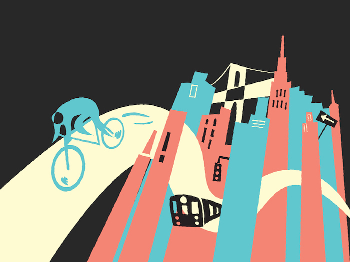
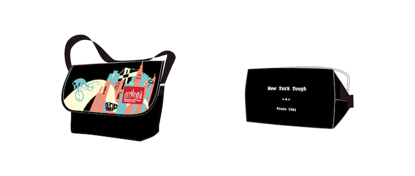
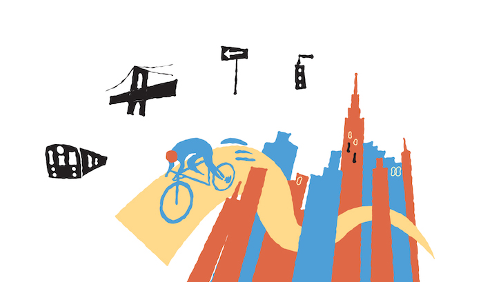

Manhattan Portage is one of the most well-known messenger bag brand and
manufacturer in the world. They started from New York City in 1983. The
philosophy they set out back in 1983, is "New York Tough." Their outdoor gear
and packs are crafted with materials such as CORDURA brand nylon. "Manhattan
Portage Art Award" is held every year and artists create design that matches
Manhattan Portage's culture, materials and philosophy of "New York Tough".

