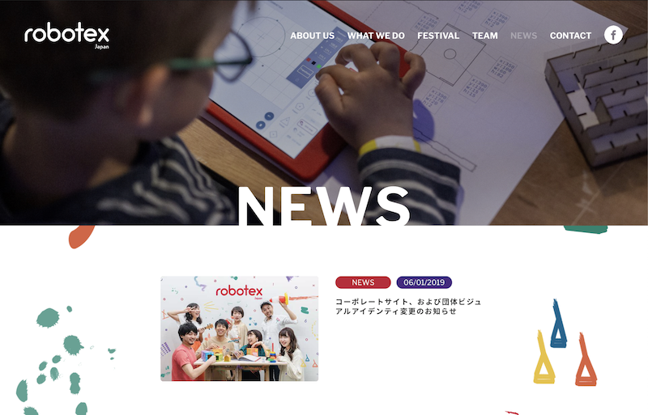

Robotex International is a global robotics education network focusing on
robotics education and startup training. Established back in 2001, Robotex has
expanded the network to over 18 countries. In October 2019, Robotex Japan
continues to grow its presence in Japanese education scene.

 

