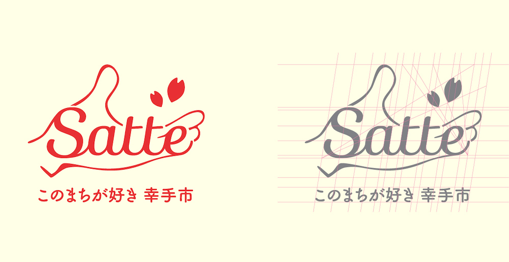

Satte city is residential region located in Saitama Prefecture. The city hall
was seeking the catchy and symbolic logo for use of city promotion. The name
means "Happy" and "Hand". The city is also famous for cherry-blossom.

