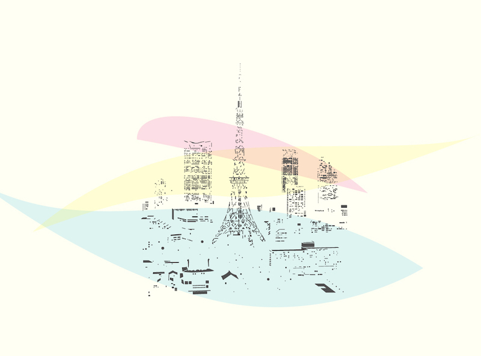
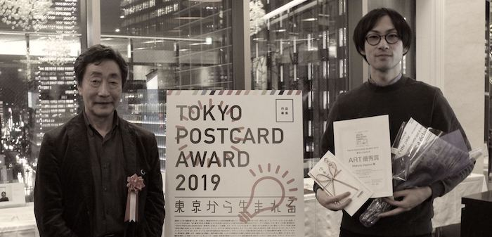
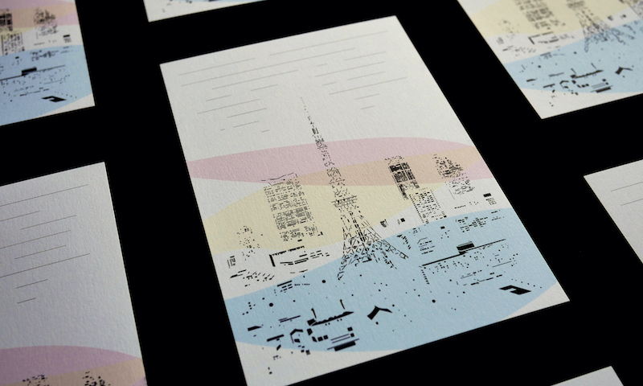
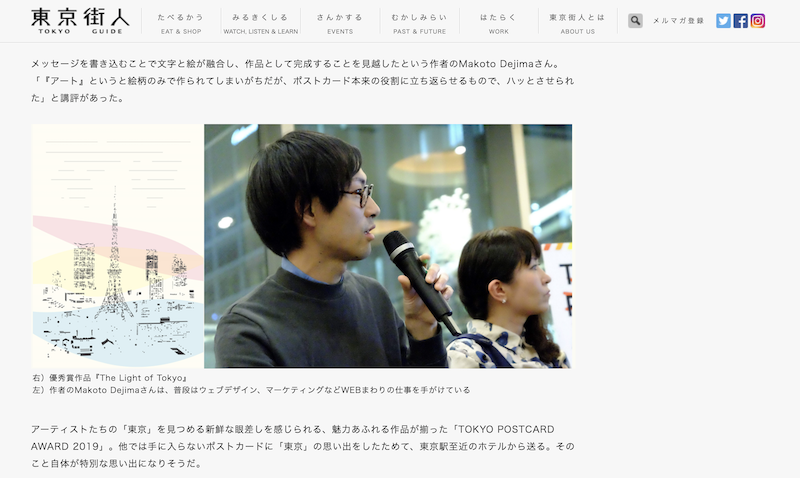
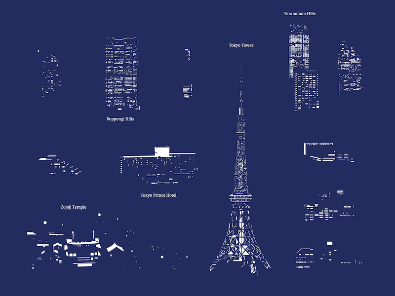
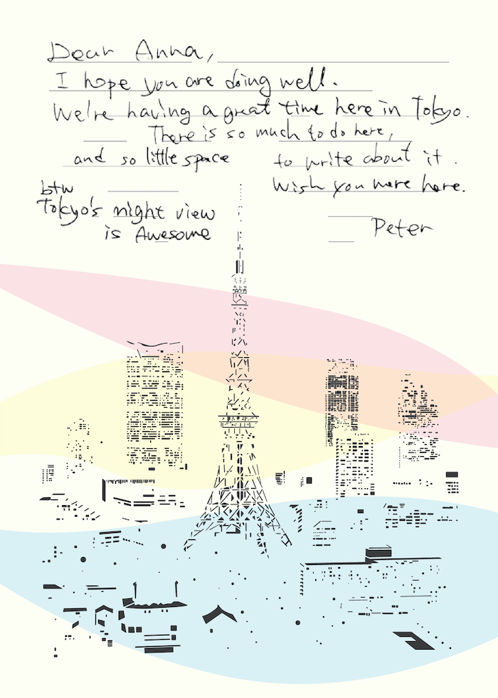

Postcard design for the boutique hotel brand, Hotel Ryumeikan Tokyo. The
postcard is being offered to the guests as an amenity in every single room.
Ryumeikan Tokyo has over a hundred years of history and now owns four locations
in the central part of Tokyo. As the message written in the card, each letter
starts to get dissolved into the night scape, as the light coming out of
buildings are printed with dark grey color. The post card won the "Tokyo
Postcard Award 2019".

